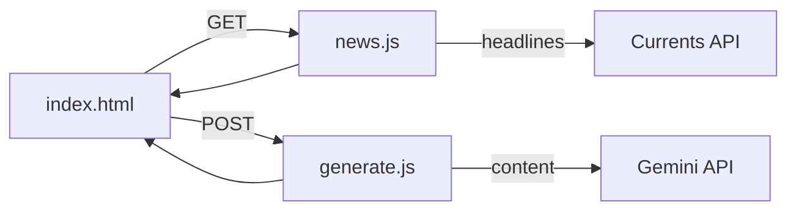

# The Daily Expedition

A daily briefing app that turns real-world news into a calm, magazine-style intellectual expedition. Each session picks one substantive story from today's headlines, opens a short doorway into it, and offers six curated questions you can explore in depth—with optional lenses like historical roots, economic analysis, or opposing views.

Single-page web app, no build step, deploys to Netlify in minutes, and works well as a phone home-screen shortcut.

## Features

- **Real news, one doorway** — Fetches today's English headlines via [Currents API](https://currentsapi.services), filters out sports and entertainment, and uses Gemini to choose the single most intellectually rich story.
- **Six exploration threads** — Tagged questions (Historical, Systemic, Geopolitical, Economic, Scientific, Wildcard) tied to that day's story.
- **Deep dives on demand** — Long-form explorations in flowing prose, generated when you tap a question.
- **Six analytical lenses** — Reframe any answer: Simply explained, Go technical, Economic lens, Historical roots, Opposing views, Second-order effects.
- **Mobile-first** — Responsive typography, safe-area insets, dark mode, Add to Home Screen on iOS and Android.
- **Keys stay server-side** — API keys live only in Netlify environment variables; the browser never sees them.

## How it works



1. On load, the client calls `/.netlify/functions/news` for filtered headlines.
2. Those headlines go to `/.netlify/functions/generate`, which asks Gemini (JSON mode) for the doorway and six questions.
3. Tapping a question or lens triggers another `generate` call for the exploration text.

## Tech stack

| Layer | Choice |
|-------|--------|
| Frontend | Vanilla HTML, CSS, JavaScript |
| Backend | Netlify serverless functions |
| News | [Currents API](https://currentsapi.services) |
| AI | [Google Gemini](https://aistudio.google.com) (`gemini-2.5-flash`) |
| Hosting | [Netlify](https://www.netlify.com) |

## Getting started

### 1. API keys

Create keys from:

- [Google AI Studio](https://aistudio.google.com) → `GEMINI_API_KEY`
- [Currents API](https://currentsapi.services) → `CURRENTS_API_KEY`
- [Netlify](https://www.netlify.com) account (free tier is sufficient)

### 2. Deploy to Netlify

**Option A — Connect this repo (recommended)**

1. In Netlify: **Add new site → Import from Git → GitHub** and select this repository.
2. Netlify reads `netlify.toml` automatically; no build command is required.
3. Under **Site configuration → Environment variables**, add:

   | Variable | Value |
   |----------|--------|
   | `GEMINI_API_KEY` | Your Gemini API key |
   | `CURRENTS_API_KEY` | Your Currents API key |

4. **Deploys → Trigger deploy → Deploy site** so functions load the new variables.

**Option B — Manual deploy**

1. Clone this repo and open the project root (the folder with `index.html` and `netlify.toml`).
2. In the [Netlify dashboard](https://app.netlify.com), use **Deploy manually** and drag that folder onto the deploy area.
3. Add the same environment variables as above, then trigger a new deploy.

Keep the folder layout as-is—`index.html`, `netlify.toml`, and `netlify/functions/` must stay in place for routing to work.

### 3. Use on your phone

1. Open your Netlify URL in Safari (iPhone) or Chrome (Android).
2. **iPhone:** Share → **Add to Home Screen**
3. **Android:** Menu → **Add to Home Screen**

The app then launches like a native shortcut from your home screen.

## Local development

Requires [Node.js](https://nodejs.org) and the [Netlify CLI](https://docs.netlify.com/cli/get-started/):

```bash
npm install -g netlify-cli
cp .env.example .env
# Add your API keys to .env
netlify dev
```

Open the URL shown in the terminal (usually `http://localhost:8888`). Functions are available at `/.netlify/functions/news` and `/.netlify/functions/generate`.

Do not commit `.env`.

## Project structure

```
├── index.html              # UI, styles, client logic
├── netlify.toml            # Netlify config
├── netlify/functions/
│   ├── news.js             # Currents API proxy
│   └── generate.js         # Gemini API proxy
├── .env.example            # Local env template
├── LICENSE
└── README.md
```

## Environment variables

| Name | Required | Used by |
|------|----------|---------|
| `GEMINI_API_KEY` | Yes | `generate.js` |
| `CURRENTS_API_KEY` | Yes | `news.js` |

Never commit API keys. If a key is exposed, rotate it in the provider dashboard and update Netlify (or your local `.env`).

## Daily use

- Open once a day; the doorway and questions load from today's news.
- Tap a question to explore it; use the lens chips at the bottom to reframe the same thread.
- Expect about 15–20 minutes per session (~2 Currents requests and ~3 Gemini calls).

## Cost

Typical daily use stays within free tiers:

| Service | Free tier | Per session |
|---------|-----------|-------------|
| Currents | 600 requests/day | ~2 |
| Gemini | Generous daily quota | ~3 |
| Netlify | Personal static + functions | Minimal |

## Troubleshooting

| Symptom | What to try |
|---------|-------------|
| **"The expedition couldn't load"** | Confirm both env vars are set in Netlify, then **Deploys → Trigger deploy**. |
| **News API error** | Re-copy `CURRENTS_API_KEY` from the Currents dashboard. |
| **Gemini error** | Verify the key in [AI Studio](https://aistudio.google.com); check rate limits. |
| **Broken layout on phone** | Use Safari (iOS) or Chrome (Android); hard-refresh the page. |

After changing environment variables, always redeploy so serverless functions pick them up.

## License

[MIT License](./LICENSE)

## Author

Built by [Saarthak Gupta](https://github.com/saarthakg).
