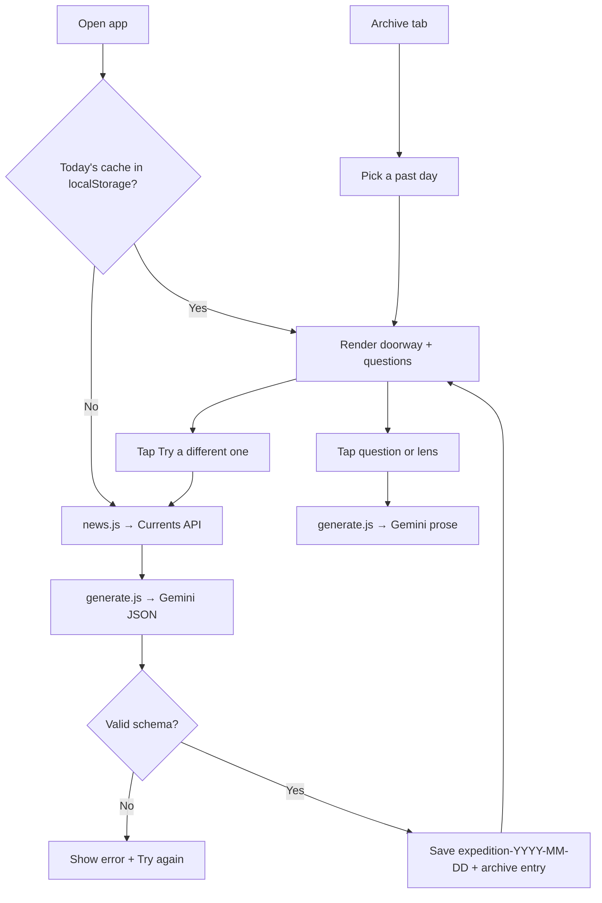

# The Daily Expedition

A daily briefing app that turns real-world news into a calm, magazine-style intellectual expedition. Each session picks one substantive story from today's headlines, opens a short doorway into it, and offers six curated questions you can explore in depth—with optional lenses like historical roots, economic analysis, or opposing views.

Single-page web app, no build step, deploys to Netlify in minutes, and works well as a phone home-screen shortcut.

## Features

- **Real news, one doorway** — Fetches today's English headlines via [Currents API](https://currentsapi.services), filters out sports and entertainment, and uses Gemini to choose the single most intellectually rich story.
- **Six exploration threads** — Tagged questions (Historical, Systemic, Geopolitical, Economic, Scientific, Wildcard) tied to that day's story.
- **Deep dives on demand** — Long-form explorations in flowing prose, generated when you tap a question.
- **Six analytical lenses** — Reframe any answer: Simply explained, Go technical, Economic lens, Historical roots, Opposing views, Second-order effects.
- **Daily local cache** — The doorway and six questions are stored in `localStorage` for the rest of the day, so repeat visits load instantly without re-calling the news or Gemini APIs.
- **Archive** — Every day's doorway and questions are also kept in a rolling 14-day local history, browsable from the Archive tab. Old threads stay explorable (each tap still calls Gemini fresh) even after the day's daily cache is gone.
- **Regenerate** — Not feeling today's story? One tap fetches a fresh doorway, explicitly steering Gemini away from the story you just saw.
- **Resilient by default** — Gemini's JSON is schema-checked before it's trusted, truncated responses are detected, requests time out instead of hanging, and every failure state offers a "Try again" button.
- **Installable PWA** — A web app manifest and generated icon set make "Add to Home Screen" produce a real app icon on iOS and Android, not a page screenshot.
- **Mobile-first** — Responsive typography, safe-area insets, dark mode, Add to Home Screen on iOS and Android.
- **Keys stay server-side** — API keys live only in Netlify environment variables; the browser never sees them.

## How it works



1. On first open each calendar day, the client fetches headlines, builds the expedition via Gemini, and caches the result under `expedition-YYYY-MM-DD` and in the rolling archive (`expedition-archive`).
2. Later opens the same day skip the network and render from the daily cache immediately.
3. Old daily-cache keys are removed on each load so `localStorage` does not grow over time; the archive is pruned separately to the most recent 14 days.
4. Tapping a question or lens always calls Gemini fresh for that exploration (not cached) — from either today's expedition or an archived one.
5. Tapping "Try a different one" discards today's cached pick, asks Gemini for a distinct story, and overwrites both the daily cache and today's archive entry.

Explorations are generated on demand; only each day's doorway and question set are cached.

## Tech stack

| Layer | Choice |
|-------|--------|
| Frontend | Vanilla HTML, CSS, JavaScript |
| Backend | Netlify serverless functions (30s timeout) |
| News | [Currents API](https://currentsapi.services) |
| AI | [Google Gemini](https://aistudio.google.com) (`gemini-2.5-flash`, up to 8192 output tokens) |
| Hosting | [Netlify](https://www.netlify.com) — auto-deploys on push to `main` when connected to GitHub |
| App shell | `manifest.json` + `icons/` — installable PWA, no service worker |

## Getting started

### 1. API keys

Create keys from:

- [Google AI Studio](https://aistudio.google.com) → `GEMINI_API_KEY`
- [Currents API](https://currentsapi.services) → `CURRENTS_API_KEY`
- [Netlify](https://www.netlify.com) account (free tier is sufficient)

### 2. Deploy to Netlify

**Option A — Connect this repo (recommended)**

1. In Netlify: **Add new site → Import from Git → GitHub** and select this repository.
2. Netlify reads `netlify.toml` automatically; no build command is required.
3. Under **Site configuration → Environment variables**, add:

   | Variable | Value |
   |----------|--------|
   | `GEMINI_API_KEY` | Your Gemini API key |
   | `CURRENTS_API_KEY` | Your Currents API key |

4. **Deploys → Trigger deploy → Deploy site** so functions load the new variables.

After the site is linked to GitHub, every push to `main` triggers a new deploy automatically.

**Option B — Manual deploy**

1. Clone this repo and open the project root (the folder with `index.html` and `netlify.toml`).
2. In the [Netlify dashboard](https://app.netlify.com), use **Deploy manually** and drag that folder onto the deploy area.
3. Add the same environment variables as above, then trigger a new deploy.

Keep the folder layout as-is—`index.html`, `netlify.toml`, and `netlify/functions/` must stay in place for routing to work.

### 3. Use on your phone

1. Open your Netlify URL in Safari (iPhone) or Chrome (Android).
2. **iPhone:** Share → **Add to Home Screen**
3. **Android:** Menu → **Add to Home Screen**

The app then launches like a native shortcut from your home screen, using the icon defined in `manifest.json` (not a screenshot of the page).

## Local development

Requires [Node.js](https://nodejs.org) and the [Netlify CLI](https://docs.netlify.com/cli/get-started/):

```bash
npm install -g netlify-cli
cp .env.example .env
# Add your API keys to .env
netlify dev
```

Open the URL shown in the terminal (usually `http://localhost:8888`). Functions are available at `/.netlify/functions/news` and `/.netlify/functions/generate`.

Do not commit `.env`.

To test a fresh daily load locally, clear today's cache in the browser console:

```javascript
localStorage.removeItem('expedition-' + new Date().toISOString().slice(0, 10));
location.reload();
```

To also clear the archive (e.g. to test the empty-archive state):

```javascript
localStorage.removeItem('expedition-archive');
```

## Project structure

```
├── index.html              # UI, styles, client logic (cache, archive, regenerate)
├── manifest.json           # Web app manifest (installable PWA)
├── icons/                  # Generated app icons (favicon, apple-touch, 192/512)
├── netlify.toml            # Function paths, 30s timeouts, publish dir
├── netlify/functions/
│   ├── news.js             # Currents API proxy
│   └── generate.js         # Gemini API proxy
├── .env.example            # Local env template
├── LICENSE
└── README.md
```

## Environment variables

| Name | Required | Used by |
|------|----------|---------|
| `GEMINI_API_KEY` | Yes | `generate.js` |
| `CURRENTS_API_KEY` | Yes | `news.js` |

Never commit API keys. If a key is exposed, rotate it in the provider dashboard and update Netlify (or your local `.env`).

## Daily use

- Open once a day; the first visit builds and caches today's doorway and questions.
- Reopening the same day is instant—the cache is used until midnight (local date).
- Tap a question to explore it; use the lens chips at the bottom to reframe the same thread. Each exploration is a new Gemini call.
- Not feeling today's pick? Tap **Not feeling this story? Try a different one** below the questions to regenerate today's doorway.
- Use the **Archive** tab to revisit any of the last 14 days' doorways and re-explore their questions.
- A full session is about 15–20 minutes.

## API usage and caching

| Action | API calls |
|--------|-----------|
| First open of the day | 1× Currents + 1× Gemini (doorway JSON) |
| Same-day return visit | None (reads `localStorage`) |
| Each question or lens explored (today or archive) | 1× Gemini (prose) |
| "Try a different one" (regenerate) | 1× Currents + 1× Gemini (doorway JSON) |

Typical daily use: one news fetch and one doorway generation, plus a handful of exploration calls as you read.

The client tolerates imperfect Gemini JSON (markdown fences, extra wrapping) before parsing the expedition payload, and validates the parsed result has a headline, doorway, domain tag, and exactly six well-formed questions before trusting it. Netlify functions use a **30 second** timeout, and the client aborts its own requests after 28 seconds so a hung connection fails with a clear message instead of spinning forever.

## Cost

Typical daily use stays within free tiers:

| Service | Free tier | Typical day |
|---------|-----------|-------------|
| Currents | 600 requests/day | 1 (first load only) |
| Gemini | Generous daily quota | 1 doorway + explorations you open |
| Netlify | Personal static + functions | Minimal |

Caching the daily doorway cuts repeat API usage when you check back later the same day.

## Troubleshooting

| Symptom | What to try |
|---------|-------------|
| **"The expedition couldn't load"** | Confirm both env vars are set in Netlify, then **Deploys → Trigger deploy**. Click **Try again** once the cause is fixed — no reload needed. |
| **News API error** | Re-copy `CURRENTS_API_KEY` from the Currents dashboard. |
| **Gemini error / timeout** | Verify the key in [AI Studio](https://aistudio.google.com); check rate limits. Functions allow up to 30s—very long answers may still fail. |
| **"Response is missing..." / malformed JSON error** | Gemini returned incomplete or off-schema JSON. Click **Try again** — this is a rare model hiccup, not a config problem. |
| **Stale or wrong day's story** | Clear cache: `localStorage.removeItem('expedition-' + new Date().toISOString().slice(0, 10))` then reload — or just tap **Try a different one**. |
| **Archive is empty** | The archive only fills as you use the app day to day; there is nothing to backfill from before this feature existed. |
| **Broken layout on phone** | Use Safari (iOS) or Chrome (Android); hard-refresh the page. |

After changing environment variables, always redeploy so serverless functions pick them up.

## License

[MIT License](./LICENSE)

## Author

Built by [Saarthak Gupta](https://github.com/saarthakg).
