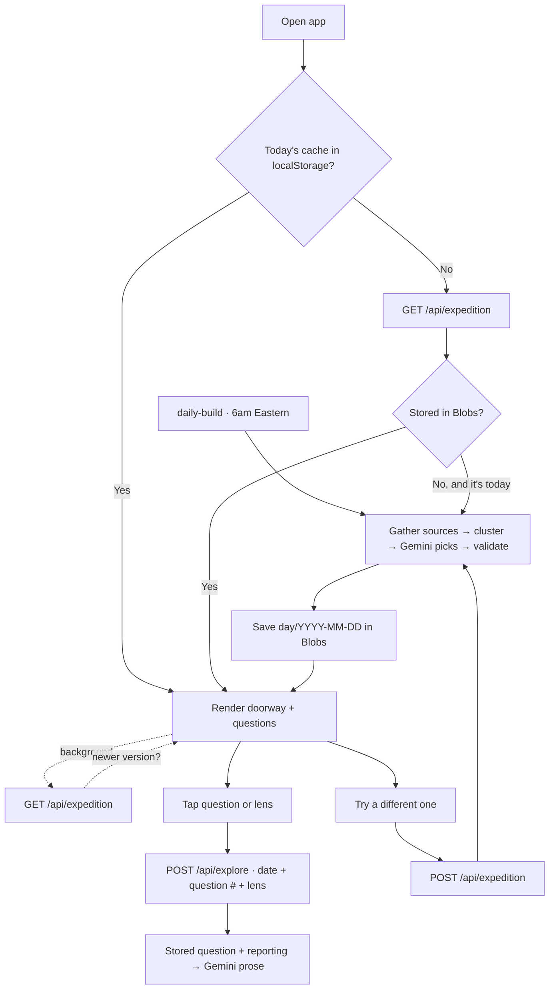

# The Daily Expedition

A daily briefing app that turns real-world news into a calm, magazine-style intellectual expedition. Each day it gathers headlines from a dozen outlets plus social and market signals, picks one substantive story, opens a short doorway into it, and offers six curated questions you can explore in depth—with optional lenses like historical roots, economic analysis, or opposing views.

Single-page web app, no build step, deploys to Netlify in minutes, and works well as a phone home-screen shortcut.

## Features

- **Many sources, one doorway** — Pulls today's headlines from BBC, NPR, the Guardian, NYT, Al Jazeera, DW, CNBC, Ars Technica, Nature, Wikipedia's *In the news* and (optionally) Currents, then groups articles about the same story across outlets. Each story is scored by how widely it's covered and whether it's trending on Bluesky or Hacker News, and Gemini picks the most intellectually rich one from that shortlist — with summaries in hand, so it doesn't invent details.
- **Links to the reporting** — Each doorway shows which outlets covered the story ("Reported by BBC · NPR · Guardian…"), linking to their articles.
- **Prediction markets as context** — Gemini attaches any Polymarket markets that bear directly on the story, and explorations can cite what the market currently expects.
- **Six exploration threads** — Tagged questions (Historical, Systemic, Geopolitical, Economic, Scientific, Wildcard) tied to that day's story.
- **Deep dives on demand** — Long-form explorations in flowing prose, generated when you tap a question.
- **Six analytical lenses** — Reframe any answer: Simply explained, Go technical, Economic lens, Historical roots, Opposing views, Second-order effects.
- **Built once a day, on the server** — A scheduled function builds the expedition at 6am Eastern and stores it in Netlify Blobs, so opening the app is instant and every device sees the same story. If you're up before the build, the first open of the day builds it.
- **Daily local cache** — The doorway and six questions are also kept in `localStorage`, so the app renders immediately and then quietly checks the server for a newer version (e.g. a story you swapped on another device).
- **Archive** — Every day's doorway and questions are also kept in a rolling 14-day local history, browsable from the Archive tab. Old threads stay explorable (each tap still calls Gemini fresh).
- **Regenerate** — Not feeling today's story? One tap picks a different one from the same shortlist, steering Gemini away from every earlier pick. Capped at five swaps a day.
- **Resilient by default** — Every news source is optional: one failing feed is logged and skipped. Gemini's JSON is schema-checked before it's trusted, truncated responses are detected, requests time out instead of hanging, and every failure state offers a "Try again" button.
- **Installable PWA** — A web app manifest and generated icon set make "Add to Home Screen" produce a real app icon on iOS and Android, not a page screenshot.
- **Mobile-first** — Responsive typography, safe-area insets, dark mode, Add to Home Screen on iOS and Android.
- **Keys stay server-side, and so do prompts** — API keys live only in Netlify environment variables. The browser never sends prompt text: it asks for a date, a question number, and one of six lenses, and the server looks the question up in its stored copy of the day. Both endpoints use Netlify's built-in per-IP rate limiting.

## How it works


```mermaid
flowchart TD
  S[daily-build · 6am Eastern] --> G
  A[Open app] --> B{Today's cache in localStorage?}
  B -->|Yes| C[Render doorway + questions]
  C -.->|background| R[GET /api/expedition] -.->|newer version?| C
  B -->|No| R2[GET /api/expedition]
  R2 --> K{Stored in Blobs?}
  K -->|Yes| C
  K -->|No, and it's today| G[Gather sources → cluster → Gemini picks → validate]
  G --> ST[Save day/YYYY-MM-DD in Blobs]
  ST --> C
  C --> H[Tap question or lens]
  H --> E[POST /api/explore · date + question # + lens]
  E --> EG[Stored question + reporting → Gemini prose]
  C --> J["Try a different one"] --> P[POST /api/expedition] --> G
```

1. **Gather** (`netlify/lib/sources.mjs`) — Fetches ~12 RSS feeds, Wikipedia *In the news*, Hacker News, Bluesky trends, Polymarket, and Currents (if a key is set) in parallel, each with an 8-second timeout. A source that fails is recorded and skipped.
2. **Cluster and score** (`netlify/lib/cluster.mjs`) — Groups articles about the same story by headline word overlap. Scores each story by distinct outlets covering it, plus boosts for Wikipedia, Hacker News points, and a matching Bluesky trend.
3. **Pick and write** (`netlify/lib/expedition.mjs`) — Sends the top ~30 stories (each with summary, other outlets' headlines, and attention signals) plus the prediction markets to Gemini, which chooses one, writes the doorway and six questions, and names any relevant markets.
4. **Store** (`netlify/lib/store.mjs`) — Saves the day to Netlify Blobs, including the candidate shortlist (reused by regenerate for 3 hours) and earlier versions (so an exploration from a page loaded before a swap still works).
5. **Explore** — Each question or lens is answered fresh by Gemini, grounded in the chosen story's reporting from each outlet.

## Tech stack

| Layer | Choice |
|-------|--------|
| Frontend | Vanilla HTML, CSS, JavaScript |
| Backend | Netlify Functions (modern `.mjs` syntax, 60s limit) + a scheduled function |
| Storage | [Netlify Blobs](https://docs.netlify.com/build/data-and-storage/netlify-blobs/) — one record per day |
| News | Free RSS feeds, Wikipedia, Hacker News (Algolia), Bluesky public API, Polymarket, optional [Currents API](https://currentsapi.services) |
| AI | [Google Gemini](https://aistudio.google.com) (`gemini-2.5-flash`, up to 8192 output tokens) |
| Hosting | [Netlify](https://www.netlify.com) — auto-deploys on push to `main` when connected to GitHub |
| App shell | `manifest.json` + `icons/` — installable PWA, no service worker |

## Getting started

### 1. API keys

Create keys from:

- [Google AI Studio](https://aistudio.google.com) → `GEMINI_API_KEY`
- [Currents API](https://currentsapi.services) → `CURRENTS_API_KEY` (optional — one more headline source)
- [Netlify](https://www.netlify.com) account (free tier is sufficient)

### 2. Deploy to Netlify

**Option A — Connect this repo (recommended)**

1. In Netlify: **Add new site → Import from Git → GitHub** and select this repository.
2. Netlify reads `netlify.toml` automatically and installs `package.json` dependencies; no build command is required.
3. Under **Site configuration → Environment variables**, add:

   | Variable | Value |
   |----------|--------|
   | `GEMINI_API_KEY` | Your Gemini API key |
   | `CURRENTS_API_KEY` | Your Currents API key (optional) |

4. **Deploys → Trigger deploy → Deploy site** so functions load the new variables.

After the site is linked to GitHub, every push to `main` triggers a new deploy automatically.

**Option B — Manual deploy**

1. Clone this repo and open the project root (the folder with `index.html` and `netlify.toml`).
2. In the [Netlify dashboard](https://app.netlify.com), use **Deploy manually** and drag that folder onto the deploy area.
3. Add the same environment variables as above, then trigger a new deploy.

Keep the folder layout as-is—`index.html`, `netlify.toml`, `package.json`, and `netlify/` must stay in place for routing to work.

Deploy previews and branch deploys keep their own separate Blobs store, so trying things out on a preview (including regenerating) never changes the live site's story. The scheduled build only runs on the published (production) deploy, not on branch deploys or deploy previews. To run it on demand, open **Logs → Functions → daily-build → Run now** in Netlify.

### 3. Use on your phone

1. Open your Netlify URL in Safari (iPhone) or Chrome (Android).
2. **iPhone:** Share → **Add to Home Screen**
3. **Android:** Menu → **Add to Home Screen**

The app then launches like a native shortcut from your home screen, using the icon defined in `manifest.json` (not a screenshot of the page).

## Local development

Requires [Node.js](https://nodejs.org) 22.12+ and the [Netlify CLI](https://docs.netlify.com/cli/get-started/):

```bash
npm install -g netlify-cli
npm install
cp .env.example .env
# Add your API keys to .env
netlify dev
```

Open the URL shown in the terminal (usually `http://localhost:8888`). The endpoints are `/api/expedition` and `/api/explore`; `netlify dev` gives you a local, throwaway Blobs store. To run the morning build by hand:

```bash
netlify functions:invoke daily-build
```

Do not commit `.env`.

To test a fresh daily load locally, clear today's cache in the browser console:

```javascript
localStorage.removeItem('expedition-' + todayKeyDate());
location.reload();
```

To also clear the archive (e.g. to test the empty-archive state):

```javascript
localStorage.removeItem('expedition-archive');
```

## Project structure

```
├── index.html                  # UI, styles, client logic (cache, archive, regenerate)
├── manifest.json               # Web app manifest (installable PWA)
├── icons/                      # Generated app icons (favicon, apple-touch, 192/512)
├── netlify.toml                # Functions dir, Node version, publish dir
├── package.json                # @netlify/blobs
├── netlify/functions/
│   ├── expedition.mjs          # GET/POST /api/expedition — fetch, build, or regenerate a day
│   ├── explore.mjs             # POST /api/explore — explore a stored question through a lens
│   └── daily-build.mjs         # Scheduled: builds today's expedition at 6am Eastern
├── netlify/lib/
│   ├── sources.mjs             # Fetches and normalises every news/social/market source
│   ├── cluster.mjs             # Groups the same story across outlets and scores attention
│   ├── expedition.mjs          # Prompts, Gemini calls, validation
│   └── store.mjs               # Netlify Blobs read/write
├── .env.example                # Local env template
├── LICENSE
└── README.md
```

## Environment variables

| Name | Required | Used by |
|------|----------|---------|
| `GEMINI_API_KEY` | Yes | Picking the story and writing explorations |
| `CURRENTS_API_KEY` | No | Adds Currents as one more headline source |
| `EXPEDITION_TZ` | No | Time zone whose date the 6am build uses (default `America/New_York`) |

Never commit API keys. If a key is exposed, rotate it in the provider dashboard and update Netlify (or your local `.env`).

## Daily use

- Open once a day; the expedition is usually already waiting, built at 6am Eastern.
- Reopening the same day is instant—the cache is used until midnight (local date), and any change made on another device is picked up in the background.
- Tap a question to explore it; use the lens chips at the bottom to reframe the same thread. Each exploration is a new Gemini call.
- Not feeling today's pick? Tap **Not feeling this story? Try a different one** below the questions to regenerate today's doorway (for all your devices).
- Use the **Archive** tab to revisit any of the last 14 days' doorways and re-explore their questions.
- A full session is about 15–20 minutes.

## API usage and caching

| Action | API calls |
|--------|-----------|
| 6am scheduled build | ~16 free source fetches (+1 Currents if configured) + 1× Gemini (doorway JSON) |
| Opening the app | 1 Blobs read (no Gemini) — or the build above, if you're up before 6am |
| Each question or lens explored (today or archive) | 1× Gemini (prose) |
| "Try a different one" (regenerate) | 1× Gemini; sources are re-fetched only if the shortlist is over 3 hours old |

Typical daily use: one doorway generation, plus a handful of exploration calls as you read — no matter how many devices you open it on.

Gemini's JSON is tolerated if slightly malformed (markdown fences, extra wrapping) and validated for a headline, doorway, domain tag, and exactly six well-formed questions before it's stored. Functions have a 60-second limit; the client gives up after 58 seconds so a hung connection fails with a clear message.

## Cost

Typical daily use stays within free tiers:

| Service | Free tier | Typical day |
|---------|-----------|-------------|
| RSS, Wikipedia, Hacker News, Bluesky, Polymarket | Free, no keys | ~16 requests at the morning build |
| Currents (optional) | 600 requests/day | 1 |
| Gemini | Generous daily quota | 1 doorway + explorations you open |
| Netlify Functions, Blobs, scheduled functions, rate limiting | Included in the free plan | Minimal |

## Troubleshooting

| Symptom | What to try |
|---------|-------------|
| **"The expedition couldn't load"** | Confirm `GEMINI_API_KEY` is set in Netlify, then **Deploys → Trigger deploy**. Click **Try again** once the cause is fixed — no reload needed. |
| **"Too few stories came back"** | Most sources failed at once — usually a network blip. Check **Logs → Functions** for the per-source report; try again shortly. |
| **A source keeps failing** | The function logs report each source's status. A dead RSS URL can be swapped in `RSS_FEEDS` in `netlify/lib/sources.mjs`. |
| **Gemini error / timeout** | Verify the key in [AI Studio](https://aistudio.google.com); check rate limits. |
| **"That day's story has changed"** | The story was swapped on another device after this page loaded. Reload. |
| **Morning build didn't run** | Scheduled functions only run on the production deploy. Use **Run now** in the Netlify UI; the first open of the day also builds it. |
| **"Response is missing..." / malformed JSON error** | Gemini returned incomplete or off-schema JSON. Click **Try again** — this is a rare model hiccup, not a config problem. |
| **Stale or wrong day's story** | Clear cache: `localStorage.removeItem('expedition-' + todayKeyDate())` then reload — or just tap **Try a different one**. |
| **Archive is empty** | The archive only fills as you use the app day to day; there is nothing to backfill from before this feature existed. |
| **Broken layout on phone** | Use Safari (iOS) or Chrome (Android); hard-refresh the page. |

After changing environment variables, always redeploy so serverless functions pick them up.

## License

[MIT License](./LICENSE)

## Author

Built by [Saarthak Gupta](https://github.com/saarthakg).
